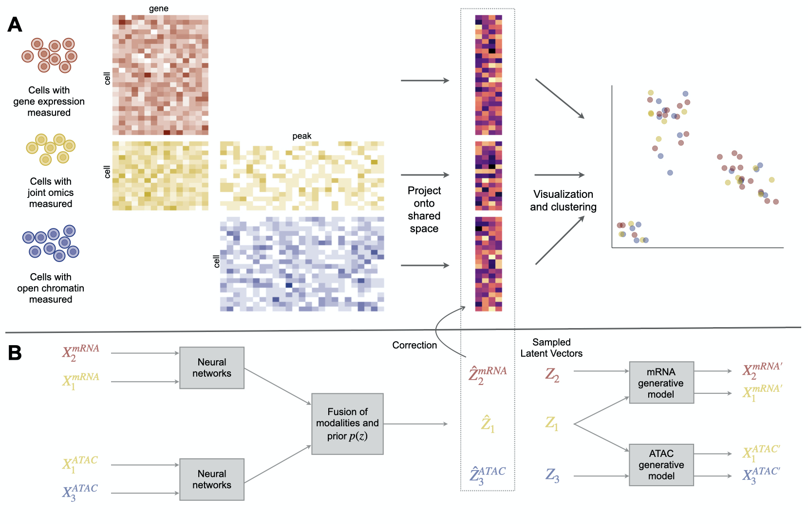

# Cobolt: Joint analysis of multimodal single-cell sequencing data

Cobolt is a Python package for 

1.  the analysis of the single-cell data from joint-modality platforms;
2.  the integration of joint-modality single-cell datasets with single-omic data sets.

## Introduction



Cobolt is a method developed for modeling multi-omic single-cell sequencing datasets. It provides an integrated analysis of multi-omic data by learning a latent representation shared by the different data modalities. Cobolt jointly models these multiple modalities via a novel application of Multimodal Variational Autoencoder to a hierarchical generative model. It uses a probablity model that is robust to sparse counts and high numbers of features, therefore works for omics such as chromatin accessibility or methylation status.

Details of the method can be found in the manuscript on [bioRxiv](https://www.biorxiv.org/content/10.1101/2021.04.03.438329v1).

## Installation

Cobolt requires Python v3.8 or higher. To install Cobolt from GitHub, run the following:

```bash
pip install git+https://github.com/epurdom/cobolt.git#egg=cobolt
```

## Tutorials

- [Integrating multi-modality platforms with single-modality platforms](https://github.com/epurdom/cobolt/blob/master/docs/tutorial.ipynb)

## Bug Reports

Cobolt is in active development. Submit bug reports and make feature requests by opening a issue [here](https://github.com/epurdom/cobolt/issues).
